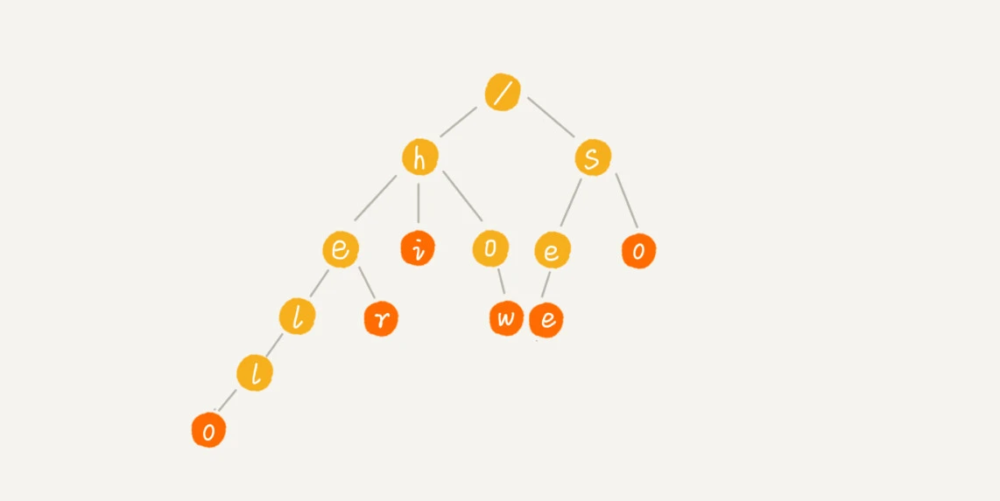
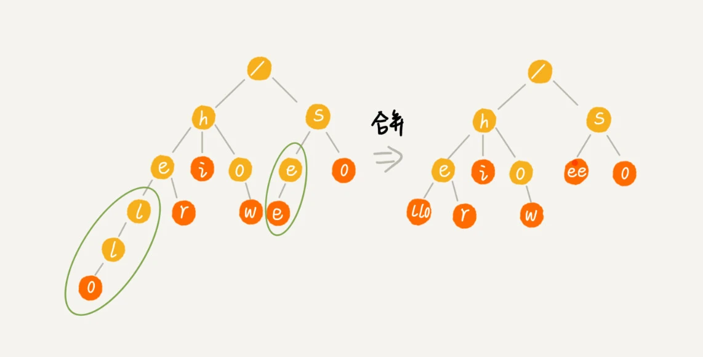
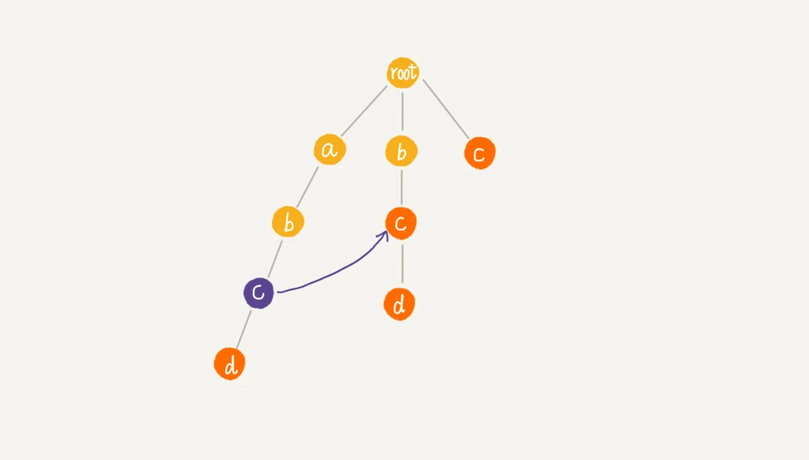
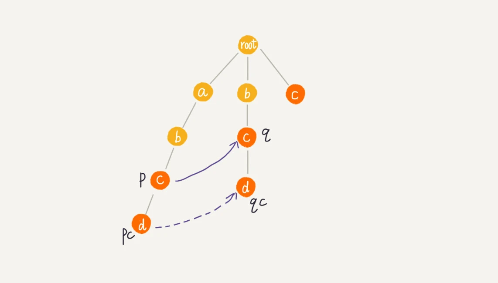
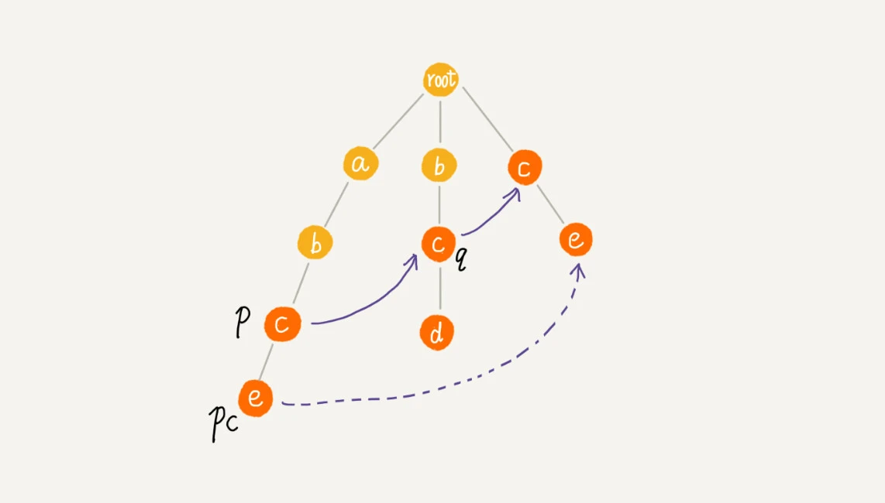

# 字符串匹配算法plus

## Trie 树

Trie 树，也叫“字典树”。顾名思义，它是一个树形结构。它是一种专门处理字符串匹配的数据结构，用来解决**在一组字符串**集合中快速查找某个字符串的问题。

Trie 树的本质，就是利用字符串之间的公共前缀，将重复的前缀合并在一起。

最后构造出来的就是下面这个图中的样子。(how，hi，her，hello，so，see。)



从**根节点到红色节点**的一条路径表示一个字符串（注意：红色节点并不都是叶子节点）。

Trie 树主要有两个操作，一个是将字符串集合构**造成** Trie 树。这个过程分解开来的话，就是一个将字符串插入到 Trie 树的过程。另一个是在 Trie 树中**查询**一个字符串。

**如何存储一个 Trie 树？**

```java
class TrieNode {
  char data;
  TrieNode children[26];
}
```

当我们在 Trie 树中查找字符串的时候，我们就可以通过字符的 ASCII 码减去“a”的 ASCII 码，迅速找到匹配的子节点的指针。比如，d 的 ASCII 码减去 a 的 ASCII 码就是 3，那子节点 d 的指针就存储在数组中下标为 3 的位置中。

Trie 树尽管有可能**很浪费内存**，但是确实非常高效。(但可以采用其他数据结构存储，比如有序数组、跳表、散列表、红黑树等，牺牲一下时间)

实际上，Trie 树的变体有很多，都可以在一定程度上解决内存消耗的问题。比如，缩点优化，就是对只有一个子节点的节点，而且此节点不是一个串的结束节点，可以将此节点与子节点合并。这样可以节省空间，但却增加了编码难度。这里我就不展开详细讲解了，你如果感兴趣，可以自行研究下。



**Trie 树与散列表、红黑树的比较？**

Trie 树实际上表现得并不好。对要处理的字符串有极其严苛的要求。

第一，字符串中包含的**字符集**不能太大。我们前面讲到，如果字符集太大，那存储空间可能就会浪费很多。即便可以优化，但也要付出牺牲查询、插入效率的代价。
第二，要求字符串的前缀**重合**比较多，不然空间消耗会变大很多。
第三，如果要用 Trie 树解决问题，那我们就要自己从零开始实现一个 Trie 树，还要保证没有 bug，这个在工程上是将简单问题复杂化，除非必须，一般不建议这样做。
第四，我们知道，通过指针串起来的数据块是不连续的，而 Trie 树中用到了指针，所以，**对缓存并不友好**，性能上会打个折扣。

实际上，Trie 树只是不适合精确匹配查找，这种问题更适合用散列表或者红黑树来解决。

Trie 树比较适合的是查找前缀匹配的字符串，

实际上，Trie 树的这个应用可以扩展到更加广泛的一个应用上，就是自动输入补全，比如输入法自动补全功能、IDE 代码编辑器自动补全功能、浏览器网址输入的自动补全功能等等。

## AC自动机

如何用 Trie 树实现敏感词过滤功能呢？

我们可以对敏感词字典进行预处理，构建成 Trie 树结构。这个预处理的操作只需要做一次，如果敏感词字典动态更新了，比如删除、添加了一个敏感词，那我们只需要动态更新一下 Trie 树就可以了。

当用户输入一个文本内容后，我们把**用户输入的内容作为主串**，从第一个字符（假设是字符 C）开始，在 Trie 树中匹配。当匹配到 Trie 树的叶子节点，或者中途遇到不匹配字符的时候，我们将主串的开始匹配位置后移一位，也就是从字符 C 的下一个字符开始，重新在 Trie 树中匹配。

借鉴单模式串的优化改进方法，能否对多模式串 Trie 树进行改进，进一步提高 Trie 树的效率呢？这就要用到 AC 自动机算法了。

AC 自动机算法，全称是 Aho-Corasick 算法。其实，Trie 树跟 AC 自动机之间的关系，就像单串匹配中朴素的串匹配算法，跟 KMP 算法之间的关系一样，只不过前者针对的是多模式串而已。

代码构建如下：

```java
public class AcNode {
  public char data; 
  public AcNode[] children = new AcNode[26]; // 字符集只包含a~z这26个字符
  public boolean isEndingChar = false; // 结尾字符为true
  public int length = -1; // 当isEndingChar=true时，记录模式串长度
  public AcNode fail; // 失败指针
  public AcNode(char data) {
    this.data = data;
  }
}
```

所以，AC 自动机的构建，包含两个操作：

- 将多个模式串构建成 Trie 树；
- 在 Trie 树上构建失败指针（相当于 KMP 中的失效函数 next 数组）。

**构建好 Trie 树之后，如何在它之上构建失败指针？**

假设我们沿 Trie 树走到 p 节点，也就是下图中的紫色节点，那 p 的失败指针就是从 root 走到紫色节点形成的字符串 abc，跟所有模式串前缀匹配的**最长可匹配后缀子串**，就是箭头指的 bc 模式串。

*字符串 abc 的后缀子串有两个 bc，c，我们拿它们与其他模式串匹配，如果某个后缀子串可以匹配某个模式串的前缀，那我们就把这个后缀子串叫作可匹配后缀子串。*

我们将 p 节点的失败指针指向那个最长匹配后缀子串对应的模式串的前缀的最后一个节点，就是下图中箭头指向的节点。



**当我们已经求得某个节点 p 的失败指针之后，如何寻找它的子节点的失败指针呢？**

情况一：如果找到了节点 q 的一个子节点 qc，对应的字符跟节点 pc 对应的字符相同



情况二：如果节点 q 中没有子节点的字符等于节点 pc 包含的字符，则令 q=q->fail，继续上面的查找

