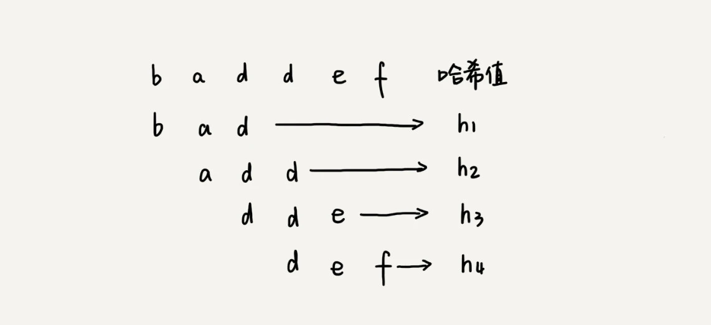
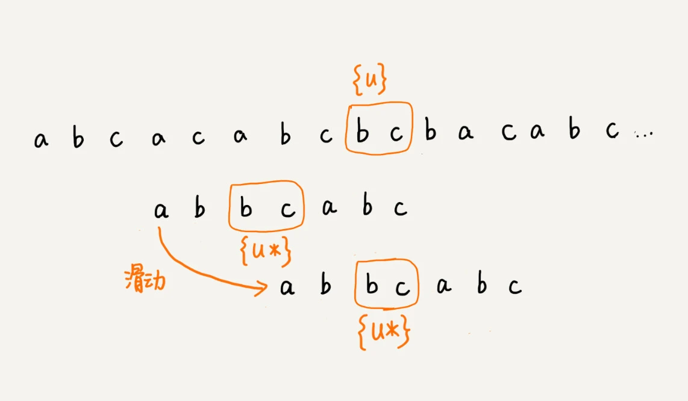

# 字符串匹配基础

**BF 算法：**

BF 算法中的 BF 是 Brute Force 的缩写，中文叫作暴力匹配算法，也叫朴素匹配算法。从名字可以看出，这种算法的字符串匹配方式很“暴力”，当然也就会比较简单、好懂，但相应的性能也不高。

这种算法的最坏情况时间复杂度是 O(n*m)

**RK 算法：**

RK 算法的全称叫 Rabin-Karp 算法，是由它的两位发明者 Rabin 和 Karp 的名字来命名的。这个算法理解起来也不是很难。我个人觉得，它其实就是刚刚讲的 BF 算法的升级版。

RK 算法的思路是这样的：我们**通过哈希算法对主串中的 n-m+1 个子串分别求哈希值**，然后逐个与模式串的哈希值比较大小。如果某个子串的哈希值与模式串相等，那就说明对应的子串和模式串匹配了（这里先不考虑哈希冲突的问题，后面我们会讲到）。因为哈希值是一个数字，数字之间比较是否相等是非常快速的，所以模式串和子串比较的效率就提高了。

**BM 算法：**

BM 算法包含两部分，分别是**坏字符规则**（bad character rule）和**好后缀规则**（good suffix shift）。
BM 算法的匹配顺序比较特别，它是按照模式串下标从大到小的顺序，**倒着匹配**的

-- **坏字符规则**

把这个没有匹配的字符叫作坏字符（主串中的字符）

1.我们拿坏字符 c 在模式串中查找，发现模式串中并不存在这个字符，也就是说，字符 c 与模式串中的任何字符都不可能匹配。这个时候，我们可以将模式串直接往后滑动三位，将模式串滑动到 c 后面的位置，再从模式串的末尾字符开始比较。

2.坏字符 a 在模式串中是存在的，模式串中下标是 0 的位置也是字符 a。这种情况下，我们可以将模式串往后滑动两位，让两个 a 上下对齐，然后再从模式串的末尾字符开始，重新匹配。

综上所述->

当发生不匹配的时候，我们把坏字符对应的模式串中的字符下标记作 si。如果坏字符在模式串中存在，我们把这个坏字符在模式串中的下标记作 xi。如果不存在，我们把 xi 记作 -1。那模式串往后移动的位数就等于 si-xi。（注意，我这里说的下标，都是字符在模式串的下标）。

-- **好后缀规则**

1.我们把已经匹配的 bc 叫作好后缀，记作{u}。我们拿它在模式串中查找，如果找到了**另一个跟{u}相匹配的子串**{u*}，那我们就将模式串滑动到子串{u*}与主串中{u}对齐的位置。

2.如果在模式串中**找不到**另一个等于{u}的子串，我们就直接将模式串，滑动到主串中{u}的后面，因为之前的任何一次往后滑动，都没有匹配主串中{u}的情况。

尽管在模式串中没有另外一个相匹配的子串{u*}，但是如果我们将模式串移动到好后缀的后面，如图所示，那就会错过模式串和主串可以匹配的情况。
所以，针对这种情况，我们不仅要看好后缀在模式串中，是否有另一个匹配的子串，我们还要考察**好后缀的后缀子串**，是否存在跟模式串的前缀子串匹配的。

当模式串滑动到前缀**与主串中{u}的后缀有部分重合**的时候，并且重合的部分相等的时候，就有可能会存在完全匹配的情况。

我们可以分别计算好后缀和坏字符往后滑动的位数，然后**取两个数中最大的**，作为模式串往后滑动的位数。这种处理方法还可以避免我们前面提到的，根据坏字符规则，计算得到的往后滑动的位数，有可能是负数的情况。

**KMP 算法：**

KMP 算法是根据三位作者（D.E.Knuth，J.H.Morris 和 V.R.Pratt）的名字来命名的，算法的全称是 Knuth Morris Pratt 算法，简称为 KMP 算法。

在模式串和主串匹配的过程中，把不能匹配的那个字符仍然叫作**坏字符**，把已经匹配的那段字符串叫作**好前缀**。

我们只需要拿好前缀本身，在**它的后缀子串**中，查找最长的那个可以**跟好前缀的前缀子串匹配的**。假设最长的可匹配的那部分前缀子串是{v}，长度是 k。我们把模式串一次性往后滑动 j-k 位，相当于，每次遇到坏字符的时候，我们就把 j 更新为 k，i 不变，然后继续比较。

**next 数组**->

KMP 算法只需要一个额外的 next 数组，数组的大小跟模式串相同。所以空间复杂度是 **O(m)**，m 表示模式串的长度。

KMP 算法的时间复杂度就是 O(m+n)。
